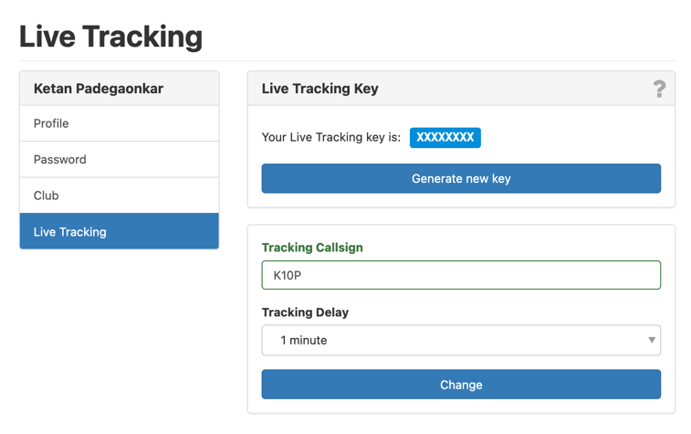

[[__TOC__]]

# Bir Paragliding Community

Welcome to the Bir Paragliding Community site. Discover how we're leveraging technology to enhance pilot safety and
improve search and rescue efforts.

## Background

Our trials in the Dhauladhar Range have shown that LoRa Mesh and Trackers are highly effective for tracking pilots and
providing communication where cellular or satellite coverage is unavailable. Unlike satellite communication—which is
heavily regulated and illegal for private use in India—LoRa technology offers a free, license-free solution.

LoRa (Long Range) is a low-power, long-range communication technology operating in the unlicensed ISM band. When paired
with the Meshtastic app on Android and iOS, it enables pilots to share their location over a decentralized mesh network,
with each device extending the network's range.

## LoRa Base Stations in Bir

In late 2023 and early 2024, volunteers set up solar-powered LoRa repeaters across key points in the Dhauladhar Range,
ensuring continuous coverage even with low pilot activity. Base stations in Bir and Dharamshala collect location data
and send it to a central server. We are currently working on secure, long-term data storage and privacy protection
measures.

With the Autumn Season of 2024 approaching, we are upgrading our infrastructure and improving our understanding of
managing these devices and data.

## FAQ

- **I'm a pilot, how do I get started?**

  1. Purchase a Meshtastic device that operates on the **_<ins>868MHz</ins>_** frequency band. We recommend the
     T-Echo from LilyGo. You can buy it from [hubtronics](https://docs.google.com/spreadsheets/d/10p-snL0-lxky0taJKvxZBNUQqcaO5LD9qC_WaZeRUKY/edit?gid=1208512175#gid=1208512175) in India at a discounted community price, or from another
     vendor of your choice. Although other Meshtastic devices are available, we suggest the T-Echo because it supports
     Soft-RF, which functions as a FLARM/FANET+/OGN beacon in most of Europe.

     

  2. Sign up for a skylines tracking ID at https://skylines.aero/users/new and get your tracking key
     from https://skylines.aero/settings/tracking

     

  3. Sign up at https://flyxc.app/devices and enter your skylines tracking ID from step above
     

  4. Install the Meshtastic app from
     the [Google Play Store](https://play.google.com/store/apps/details?id=com.geeksville.mesh&referrer=utm_source=downloads-page)
     or the [Apple App Store](https://itunes.apple.com/WebObjects/MZStore.woa/wa/viewSoftware?id=1586432531).

  5. Follow the app's instructions to pair your device.
  6. Download a configuration file for your meshtastic device from http://tracker.bircom.in/?configure
  7. The downloaded configuration sets the Bluetooth pin to `123456`. For your own safety and security, please change
     the pin from the settings section of the meshtastic app.
  8. From the meshtastic app, import the downloaded configuration file into your meshtastic device.
  9. From the meshtastic app, send a message on `LongFast`, and see if it shows up on the map
     at http://tracker.bircom.in, in addition to [the telegram group](https://t.me/meshtastic_india/22)
  10. Check if you're visible on https://flyxc.app/ and https://skylines.aero/tracking. This requires that you have a GPS fix, so make sure you're not indoors.

- **How do I contribute to the community?**

  1. Join our Telegram group at https://t.me/meshtastic_india
  2. Volunteer to set up a LoRa base station in your area
  3. Donate to our cause at https://milaap.org/fundraisers/support-paragliding-pilots-in-india/

- **I want to know more about the meshtastic setup in Bir**
  Checkout [our presentation](https://bit.ly/MeshtasticBir)
